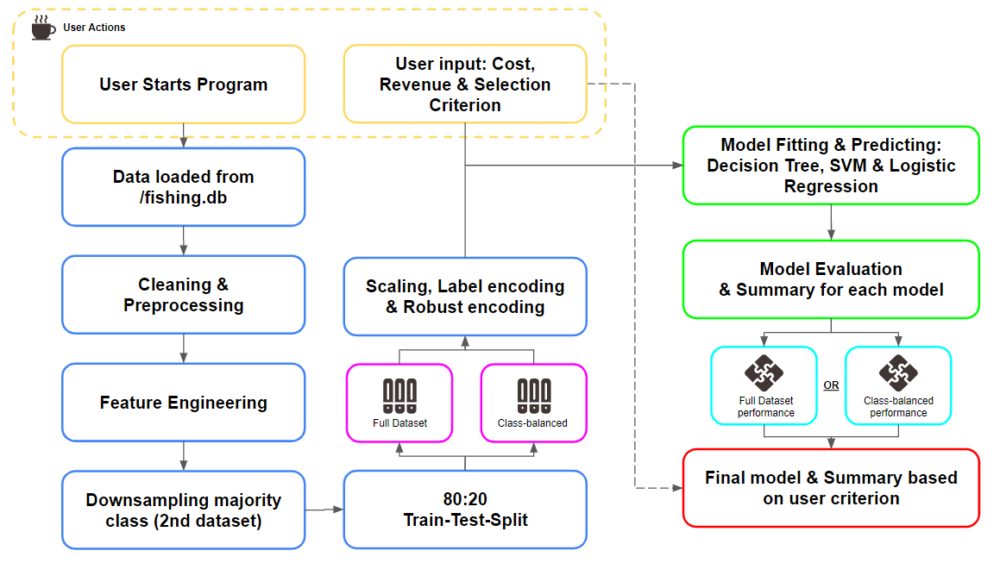
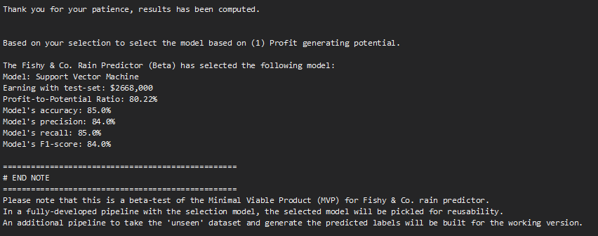

# AIAP Batch 14 Technical Assessment
Name: Ng Kok Woon<br>
Email: kokwoon.ng@gmail.com

# Project Overview
## 1A. Executive Summary
> The objective of the project is to evaluate and identify Machine Learning (ML) models that can help
> fishy & co. to predict if there will be rain the next day. 

Using the data provided by fishy & co, we will first perform a general Exploratory Data Analysis (EDA) 
to gain a better understanding of the weather dataset, before we build a end-to-end Machine Learning Pipeline (MLP)
that will be able to evaluate and recommend the best model based on the user's criterion.

The program provides the flexibility for users to provide the current cost per trip and the gross revenue before cost from each trip,
it also provides options for the users to select the model based on their criterion. For non-technical users, criterion 
such as `profit-earning potential` is provided while for technical users, they can opt for `accuracy` or `F1-score`.

The future iterations of the project would require the application to take in "unseen" data from a specified folder
to compute the predicted labels in an preferred output by the audience for their actual utilization. 

## 1B. Task Summary
- [x] Write the press release
- [ ] 2nd Task

## 1C. File Structure
The file structure of the project is extracted via Windows cmd with `tree /a /f > output.doc`
```
|   .DS_Store
|   .gitignore
|   eda.ipynb
|   output.doc
|   README.md
|   requirements.txt
|   run.sh
|   
+---.github
|   |   .DS_Store
|   |   
|   \---workflows
|           github-actions.yml
|           
+---.ipynb_checkpoints
|       eda-checkpoint.ipynb
|       
+---data
|       fishing.db
|       
|           
\---src
        mlp_pipeline.py
        preprocessor.py
```

## 1D. How to execute
There are 2 recommended ways to run the `mlp_pipeline.py` script.[^1]

### (i) Linux
Clone this project and run the `run.sh` shell bash script in your linux environment with python activated
```
# clone this notebook
git clone https://github.com/ahjimomo/aiap14-ng-kok-woon-685E.git

# run the sh script in Linux Environment
sh run.sh
```

### (ii) Windows
Clone this project and run the `run.sh` shell bash script in your `Windows PowerShell` or `command prompt` terminal.
```
# clone this notebook
git clone https://github.com/ahjimomo/aiap14-ng-kok-woon-685E.git

# run the sh script in terminal
bash run.sh
```
A sample output of the full `mlp_pipeline.py` program run can be found in the [sample_output_log.txt document]("./sample_output_log.txt").

[^1]: I am unable to find the right way to run the run.sh executable script, above is based on online research to the best of my knowledge.

# Exploratory Data Analysis (EDA)
## 2A. EDA Overview
Before we proceed to use the data, we wanted to gain better insights to the dataset and review any cleaning, preprocessing and/or 
feature-engineering that may be needed.

**We do so by starting out with a set of questions:**
1. What is the size of the dataset we are working with?
2. What is the problem we are dealing with?
3. Does the data meet the 6 dimensions of data quality?
*   Are there any missing values or duplicates? (Completeness & Uniqueness)
*   Is the data correct to the best of our knowledge? (Validity)
*   Is the target label `RainTomorrow` accurate and can we verify it? (Consistency)
*   Are the features correct based on our understanding of what they represent? (Accuracy)
*   Since our data is provided to us, we can ignore the dimension of timeliness 
4. Is there an imbalance between classes that we need to deal with?
5. Features
*   Are the numerical values normally distributed, how do we deal with outliers or missing values?
*   Are the categorical values correct, are there ordinal and nominal data?
*   What are the features that we should use?

## 2B. Findings
Based on our set questions, we performed our EDA in the [JupyterLab Notebook]("./eda.ipynb"), and
we can present the following findings:

| **Item** | **Description** | **Remark** |
| :--  | :-- | :-- |
| Size of Dataset | 12,997 rows with 21 columns | pre-processed |
| Key identifiers | `Date`-`Location` pair | |
| Duplicates | 1,182 based on our `Date`-`Location` pair | To keep only 1-record each |
| Feature: Pressures | There are inconsistency for the 3 orders of pressure for the `Pressure9am` and `Pressure3pm` features | `[low, med, high]` |
| Feature: Wind Direction | The unique values for `WindGustDir`, `WindDir9am` and `WindDir3pm` seems correct based on [Windy.app](https://windy.app/blog/what-is-wind-direction.html#:~:text=292.5%C2%B0%20%E2%80%94%20west%2Dnorthwest%20wind%20(WNW)) | |
| Distribution of Class | Our dataset has a [moderate degree of imbalance](https://developers.google.com/machine-learning/data-prep/construct/sampling-splitting/imbalanced-data) with the minority class `Yes` sitting at 1 - 20 % of the dataset | Test models with downsampled majority class vs. full dataset |
| Feature: Sunshine | Based on the business definition, `Sunshine` represents hours in a day and should be in the range of (0, 24] yet there are neg- values identified | Convert all negative to pos+ values |
| Feature+: month | From our `Date` feature, we can extract the `month` represented in the range of (0, 12] which may be useful in adding information to our model | Assumption that date might be a factor to weather |
| Feature+: predict_accurate | Using the `RainToday` from the row of `Date +1` grouped by locations, we can verify if our current row's `RainTomorrow` is accurate | Assumption that data may be incorrect |
| Feature-Selection: Numerical | Applying Pearson's correlation test with `sns.heatmap()`, we can identify the numerical features using the threshold of +0.4/-0.4 | `[Sunshine, Humidity3pm, Cloud3pm]` |
| Feature-Selection: Categorical | Applying Uncertainty Coeffeicient test (Thiel's U), we can identify the categorical features using the threshold of +0.4/-0.4 | `[Pressure9am, Pressure3pm, WindDir9am, WindDir3pm]` |


## 2C. EDA Summary for Task 2
With the findings from the EDA, we can summarize our data pre-processing and preparation that should be interegrated into the MLP pipeline:

1. **Target Label:**
*   Record's RainTomorrow for Date will be the target label for our project and it should be verified by RainToday label from Date+1 to evaluate the correctness of records
*   There is an uneven distribution skewed towards "No" for `RainTomorrow` and we should consider down-sampling the "No" class to reduce risk of over-fitting

2. **Data Cleaning:**
*   There are Date-Locations pair duplicates that should be removed
*   The `Pressure3pm` and `Pressure9am` categories has to be lowercased to standardise the 3 levels of pressure [low, med, high]
*   There are missing fields in the `RainToday` field and they should be populated based on the `Rainfall` value
*   `Sunshine` feature that represents # hours of bright sunshine contains negative values, assuming that they are incorrectly entered, all values are to be positive
*   After our data cleaning, we should remove records with missing values

3. **Data Pre-Processing/Feature Engineering:**
*   Based on our engineered feature month, we can see that month does have some linear correlation with the target class.
*   From our pie chart visulisation, we can see that our `RainTomorrow` target label is moderately imbalance, and the majority class should be downsampled.

4. **Feature Selection/Encoding:**
*   Applying Pearson's Coefficient for our numerical feature selection, there are no features with strong linear correlation (> 0.5 or < -0.5) with our target label, using a threshold of 0.4, we can select the `Sunshine`, `Humidity3pm`, and `Cloud3pm`
*   Applying Uncertainty Coefficient (Thiel-U) for our categorical feature selection, `Pressure9am` and `Pressure3pm` has strong correlation with our target label, with `WindDir9am` and `WindDir3pm` having moderate strength, we will need to apply encoding to use them for our models.
*   Numerical values except `Rainfall` does not have a large range but mostly are not normally distributed, we can performing scaling for all the numerical features (MLP Pipeline)
*   `Pressure9am` and `Pressure3pm` are ordinal data with the order of low -> high and thus we can perform label-encoding to preserve the ranking
*   The other categorical features for wind direction are nominal data with a larger unique values and thus we should explore MinMax, binary or robust encoding to mitigate the risk for curse of dimensionality

5. **Unrequired Labels:**
*   Based on our project requirement, `ColourOfBoats` should not be a factor to consider for our classification model(s)
*   `Date` and `Location` labels should also not be factors to considered
*   `RainToday` will not be required after it has been used for verification for part (1)

6. **Summary for Machine-Learning Pipeline (MLP):**
*   From the EDA, we can see that the features that we will keep for our project includes `Sunshine`, `Humidity3pm`, `Cloud3pm`, `Pressure9am (Encoding)`, `Pressure3pm (Encoding)`, `WindDir9am (Encoding)`, `WindDir3pm (Encoding)` and `RainTomorrow (Target Class)` to tackle the challenge as a *binary classification problem*

# Machine Learning Pipeline (MLP)
## 3A. Program Flow
The following flow is a snippet of how the program iteracts with the user:


_A sample output of the full `mlp_pipeline.py` program run can be found in the [sample_output_log.txt document]("./sample_output_log.txt")_

## 3B. MLP Program Design
> For our project, we have **two (2) scripts**, namely `preprocessor.py` and `mlp_pipeline.py`. The `preprocessor.py` is meant to contain supporting functions
>that is utitlized in the main `mlp_pipeline.py` so we can ensure readibility of our script for other developers/engineers while conforming to good
> developer practices such as _Don't Repeat Yourself (DRY)_ and other _SOLID principles_. 
+ **preprocessor.py**: Contains supporting functions for printing, pre-processing, cleaning and evaluations
+ **mlp_pipeline.py**: Main script that calls `preprocessor.py`, import data, get users' input, fit models and generate output. 

**A summary of the how the features in the dataset are processed:**
| **s.no** | **Type** | **Description** | **Remark** |
| :--  | :-- | :-- | :-- |
| 1 | Data Collection | Import libraries and read data from `./fishing.db` with `SQLite3` | `random_seed = 42` for reproducibility |
| 2 | Data Cleaning | Remove duplications of `Date`-`Location` pairs | Removes noise and unecessary data | 1,182 duplicates |
| 3 | Data Engineering | Creating `predict_accurate` based on `RainToday` from record's `Date+1` record to verify accuracy, remove those that are wrong/cannot be verified | |
| 4 | Data Cleaning | applying `abs()` function on `Sunshine` to correct all neg- values to pos+, within range of (0 - 24] | Assumption that business terms means #hours in a day |
| 5 | Data Cleaning | Drop all records with empty columns with `pd.dropna()` | |
| 6 | Data Preprocessing | Selecting subset of original dataset based on features selection from EDA | `['Sunshine', 'Humidity3pm', 'Cloud3pm', 'Pressure9am', 'Pressure3pm', 'WindDir9am', 'WindDir3pm', 'RainTomorrow']` |
| 7 | Data Engineering | Standardizing the 3-levels of pressure for `Pressure9am` and `Pressure3pm` features before performing label-encoding | 32 to 3, `[low -> med -> high]` |
| 8 | Data Engineering | Preparing `secondary dataset` to balance distribution between `RainTomorrow` classes by downsampling the majority class | |
| 9 | Data Preprocessing | Using `sklearn.preprocessing.


## 3D. Choice of models
For the project, we wanted to explore different variations of algorithms to identify the better models for our problem.

**We decided to go with:**
+ Decision Tree: Rule-based approach (probability)
+ Support Vector Machine: Distance-based approach (Superplane & margin)
+ Logistic Regression: Statistical-based approach (probability)
+ ~Naive Bayes Classifier~: Unable to use the model as we are using `robust scaler` which reduces the impact of outliers but may introduce negative values.

> Unfortunately, due to the time constraint with work, I did not perform further hyperparameters-turning
> and would like to test out cross-validation and other emsemble models in the future on this dataset.

## 3E. Evaluation of models
The models are evaluated based on the 4 common performance metrics for a classification task, with the inclusion of an additional measurement based on the assumed `cost per trip` and `gross revenue per trip`. Below is a generic description of the measurements based on our problem statement:

| **Measurement** | **Description** | **Remark** |
| :--  | :-- | :-- |
| Accuracy | Computed based on the correct classification of `RainTomorrow` on testing dataset of correct predictions over total predictions | |
| Precision | The rate where we predicted correctly that it will rain the next day out of the days that it actually rained | This affects our revenue bottom-line as we want to avoid heading out to fish if it actually rained since it will cost us |
| Recall (Sensitivity) | Based on all the `predictions: 'Yes'` from our model, the rate where we correctly identified that it's correct | Opportunity cost when we have `False Negative` since we do not go for fishing when it actually did not rain the next day |
| F1-Score | The harmonic mean between precision and recall, a easier way to select the model with a balance | |
| `New:` Profit-to-Potential Ratio | Since this is a business use-case designed for business users, we created a measurement based on `% of (profit from our model / total potential of 100% accuracy)` | This enable non-technical user to easily reference the potential amount of earnings they can generated based on the history dataset |

To help our users with their preferred model selection, a summarized output will be printed for the ease of their reference:


> More measurements can be applied such as use of `Precision-Recall Curve (PRC)` and `K-fold Cross Validation` in the future

**Note: For our problem statement, `accuracy + precision` may actually be a more important measurement than `recall` as heading out to fish when it rains actually hurts the company's revenue while not heading out when it's not raining incur opportunity cost but does not actually impact the revenue directly.** 

# Learnings and Reflections
The AIAP 14 Batch Assessment Test has been a challenging yet fruitful test. I was able to learn a great deal on building pipelines and gain the statistical insights behind each algorithms. The requirements such as having a executable shell bash script has also pushed me to try and experiment with programs I never had seen before, and the time limitation of 5-days was challenging for a project. 

I hope to further improve my skills and gain more knowledge and become a expert in the ML/AI field, providing value both in decisions and build end-to-end applications through AIAP.

### END - Thank you

